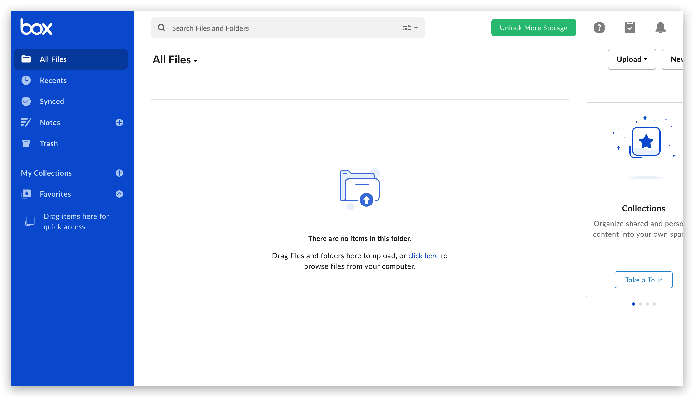

# Awesome-Online-Efficiency
       

🧰 A collection of online efficiency tools,including useful and emerging.

## Contents

- [Developer Tools](#developer-tools)
- [Design and Product](#design-and-product)
    - [Design Tools](#design-tools)
    - [Drawing Tools](#drawing-tools)
    - [Product Tools](#product-tools)
    - [Other Tools](#other-tools)
- [Writing Tools](#writing-tools)
- [Media Tools](#media-tools)
- [Cloud Storage](#cloud-storage)

## Developer Tools

* [Hoppscotch](https://hoppscotch.io/) - A free, fast and beautiful API request builder.
    

        
Preview

        
    

* [carbon](https://carbon.now.sh/) - Create and share beautiful images of your source code.
    

        
Preview

        
    

* [CodePen](https://codepen.io/) - Online Code Editor and Front End Web Developer Community.
    

        
Preview

        
    

* [Choose a License](https://choosealicense.com/) - Choose an open source license.
    

        
Preview

        
    

* [gitignore.io](https://www.toptal.com/developers/gitignore/) - Create Useful .gitignore Files For Your Project.
    

        
Preview

        
    

## Design and Product

### Design Tools

* [Figma](https://www.figma.com/) - The collaborative interface design tool, for vector graphics and UI prototyping.
    

        
Preview

        
    

* [Lanhu](https://lanhuapp.com/) - Efficient product design collaboration platform.
    

        
Preview

        
    

* [Mockplus](https://www.mockplus.com/) - The most robust all-in-one product design platform for prototyping, collaboration, and design systems.
    

        
Preview

        
    

### Drawing Tools

* [diagrams](https://app.diagrams.net/) - Flowchart Maker & Online Diagram Software.
    

        
Preview

        
    

* [ProcessOn](https://www.processon.com/) - Free online mapping, mind mapping, flow chart, real-time collaboration.
    

        
Preview

        
    

* [Creately](https://creately.com/) - Chart, Diagram & Visual Canvas Software.
    

        
Preview

        
    

    
### Product Tools

* [Taskade](https://www.taskade.com/) - All-in-One Collaboration. Remote Team Workspace.
        

        
Preview

        
    

* [TickTick](https://ticktick.com/) - Todo list, checklist and task manager app.
    

        
Preview

        
    

* [The Pomodoro Tracker](https://pomodoro-tracker.com/) - A useful tool for time management based on Pomodoro Technique.
    

        
Preview

        
    

    
    
### Other Tools
* [Typeform](https://www.typeform.com/) - People-Friendly Forms and Surveys.
    

        
Preview

        
    

* [QRBTF](https://qrbtf.com/) - Parametric QR code generator.
    

        
Preview

        
    

    

## Writing Tools

* [DeepL](https://www.deepl.com/translator/) - DeepL, an online translator that outperforms Google, Microsoft and Facebook.
    

        
Preview

        
    

* [Smallpdf](https://smallpdf.com/cn) - A Free Solution to all your PDF Problems.
    

        
Preview

        
    

* [Notion](https://www.notion.so/) - One tool for your whole team. Write, plan, and get organized.
    

        
Preview

        
    

* [Roam Research](https://roamresearch.com/) - A note-taking tool
for networked thought.
    

        
Preview

        
    

* [KgBase](https://www.kgbase.com/) - Generate insights by connecting datasets,build your own knowledge graphs without writing code.
    

        
Preview

        
    

* [WorkFlowy](https://workflowy.com/hello/) - An online notepad that helps you get organized.
    

        
Preview

        
    

* [Dynalist](https://dynalist.io/) - An online outlining notepad.
    

        
Preview

        
    

* [Coda](https://coda.io/welcome) - A new doc for teams.
    

        
Preview

        
    

* [RemNote](https://www.remnote.io/) - The Best Way to Remember and Organize What You Learn.
    

        
Preview

        
    

* [Milanote](https://milanote.com/) - the tool for organizing creative projects.
    

        
Preview

        
    

* [Crossnote](https://crossnote.app/) - Online Notebook.
    

        
Preview

        
    

* [Walling](https://walling.app/) - Visual Walls to Collect Ideas & Plot out Projects.
    

        
Preview

        
    

* [XiaoShuJiang](https://markdown.xiaoshujiang.com/) - Online Markdown Tool.
    

        
Preview

        
    

    
## Media Tools

* [SubPlayer](https://subplayer.js.org/) - An online subtitle editor.
    

        
Preview

        
    

* [LALAL.AI](https://www.lalal.ai/) - 100% AI-Powered Vocal and Instrumental Tracks Removal
    

        
Preview

        
    

* [Splitter.ai](https://www.splitter.ai/) - AI powered audio extraction
    

        
Preview

        
    

* [Moises](https://moises.ai/zh-cn/) - Extract vocals and instruments from any audio/video file. Create samples and remixes using high-fidelity audio stems powered by AI.
    

        
Preview

        
    

* [Tune My Music](https://www.tunemymusic.com/) - Transfer Playlists Between Music Services.
    

        
Preview

        
    

    
## Cloud Storage

* [box](https://www.box.com/home/) -  cloud storage which provides file sharing, collaborating, and other tools for working with files that are uploaded to its servers.
    

        
Preview

        
    

* [cowtransfer](https://cowtransfer.com/) - online file transfer service
    

        
Preview

        
    

    
    
......